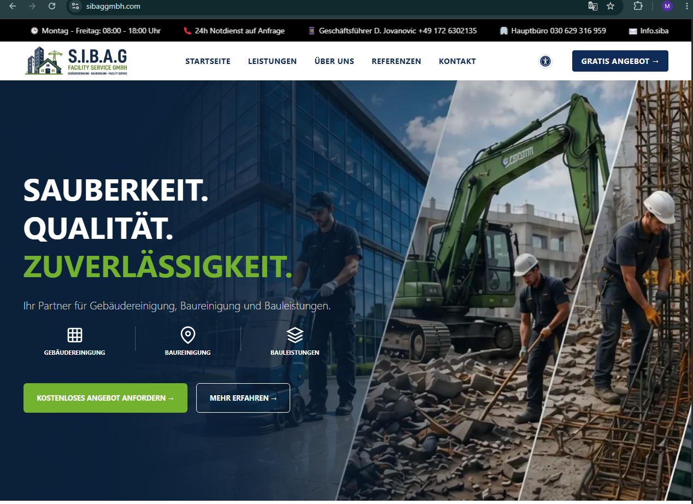
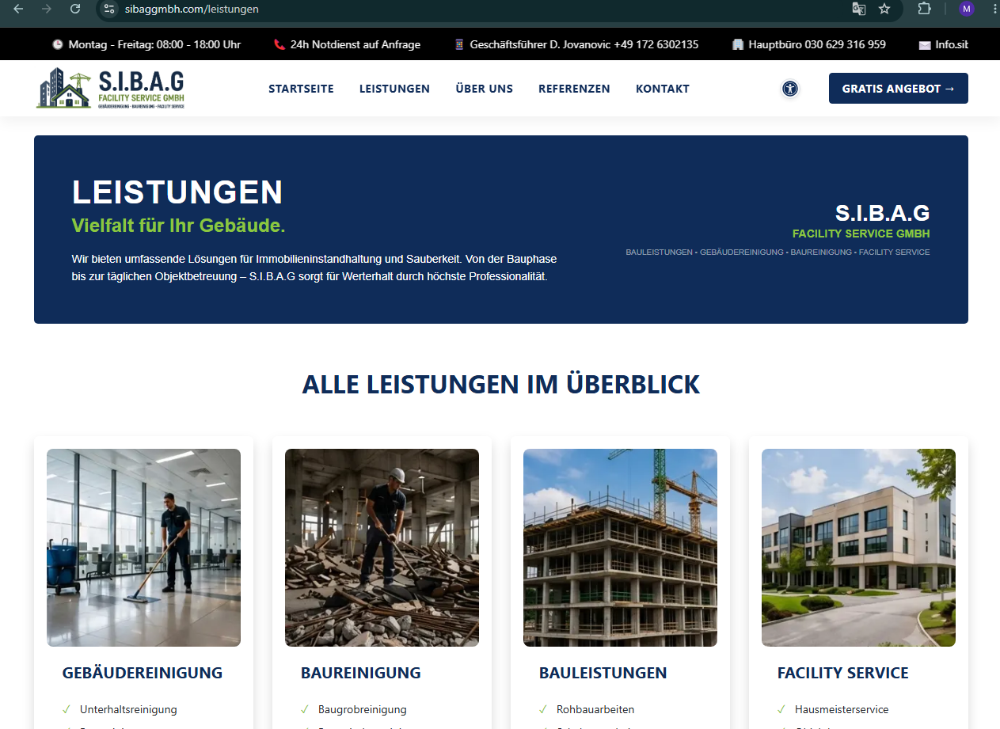
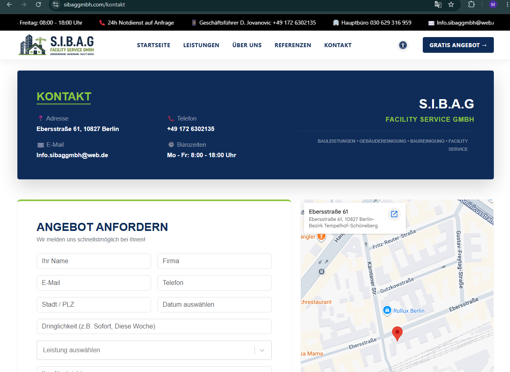

# Sibaggmbh Website

<p align="center">
  <a href="https://sibaggmbh.com" target="_blank">
    
  </a>
  <a href="https://github.com/sohelsamy1/sibaggmbh-website" target="_blank">
    
  </a>
</p>

<p align="center">


</p>

<p align="center">


</p>

## 🚀 Overview

A modern and responsive company portfolio website built entirely with **React.js**, featuring reusable components, SEO optimization, EmailJS integration, responsive layouts, and a clean user experience.

---

## ✨ Features

- Modern and responsive user interface
- Component-based React architecture
- Sticky navigation header
- Home, About, Services & Contact pages
- Responsive project showcase slider
- References section
- EmailJS contact form integration
- SEO meta tags implementation
- Optimized WebP images
- Mobile-first responsive layout
- Reusable and maintainable components
- Clean and organized project structure

---

## 🌐 Live Demo

🔗 **https://sibaggmbh.com**

---

## 🛠️ Tech Stack

| Technology | Usage |
|------------|-------|
| React.js | Frontend Framework |
| Vite | Build Tool |
| React Router DOM | Client-side Routing |
| Bootstrap 5 | Responsive UI |
| CSS3 | Custom Styling |
| HTML5 | Markup |
| EmailJS | Contact Form Integration |
| React Helmet | SEO Meta Tags |

---

## 📸 Screenshots

### 🏠 Home Page



---

### 💼 Services Page



---

### 📞 Contact Page



---

## 📁 Folder Structure

```text
src
├── assets
├── components
├── layouts
├── pages
├── App.jsx
└── main.jsx
```

---

## 🚀 Getting Started

### Clone the Repository

```bash
git clone https://github.com/sohelsamy1/sibaggmbh-website.git
```

### Navigate to the Project Directory

```bash
cd sibaggmbh
```

### Install Dependencies

```bash
npm install
```

### Run Development Server

```bash
npm run dev
```

### Build for Production

```bash
npm run build
```

---

## 📈 Development Progress

- ✅ Initial React project setup
- ✅ Bootstrap integration
- ✅ Sticky navigation implementation
- ✅ Home page development
- ✅ References section
- ✅ Footer implementation
- ✅ Contact page
- ✅ About page
- ✅ Services page
- ✅ Responsive project slider
- ✅ Contact information banner
- ✅ Footer optimization
- ✅ Responsive layout improvements
- ✅ SEO optimization
- ✅ Image optimization using WebP
- ✅ EmailJS integration

---

## 👨‍💻 Author

**Sohel Samy**

**Laravel | React | Vue Developer**

- **Portfolio:** https://sohelsamy.com
- **GitHub:** https://github.com/sohelsamy1
- **LinkedIn:** https://linkedin.com/in/sohelsamy

---

<p align="center">
Made with ❤️ using React.js & Vite
</p>